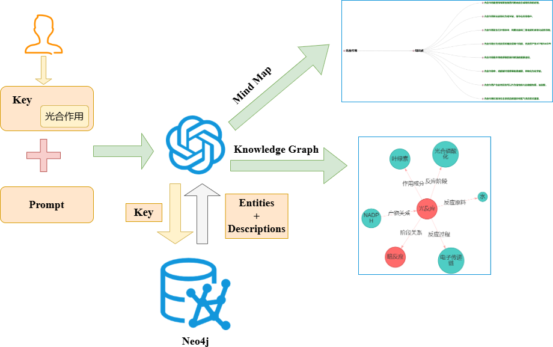
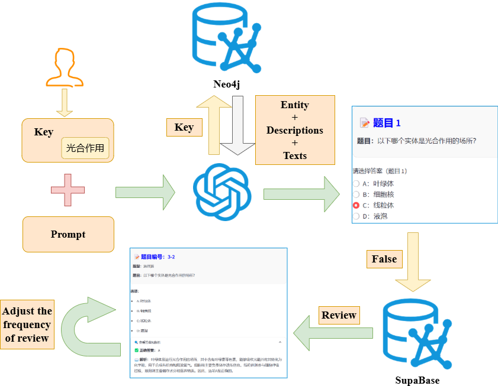
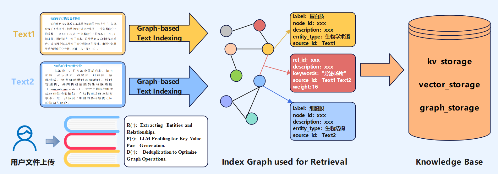
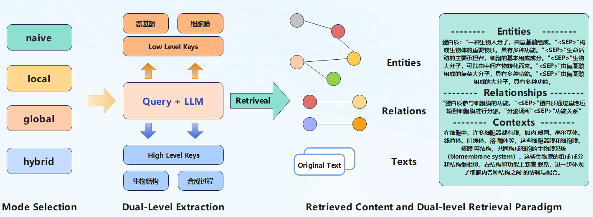
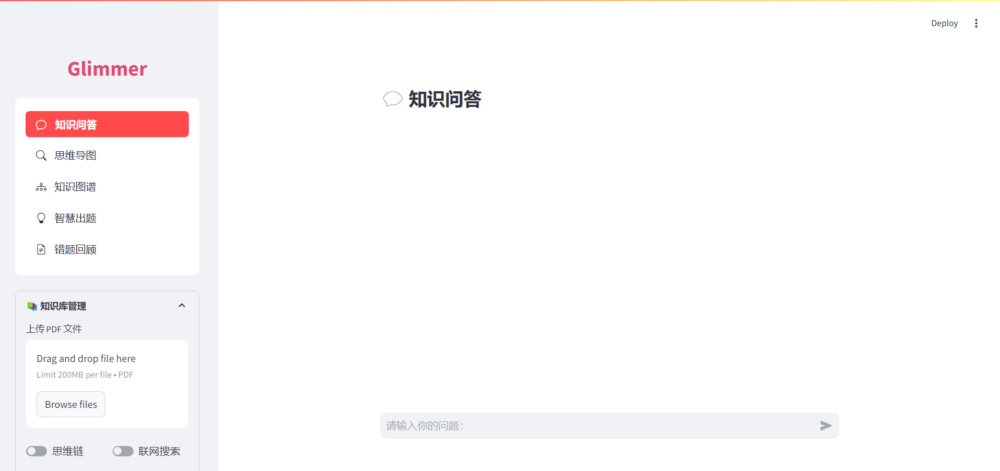
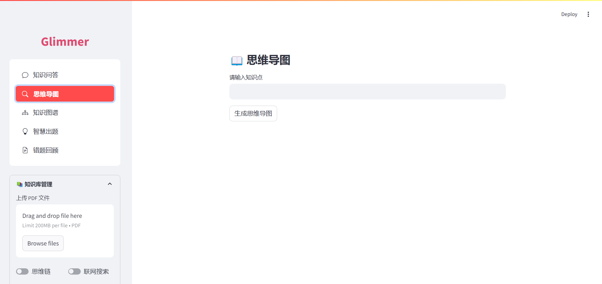
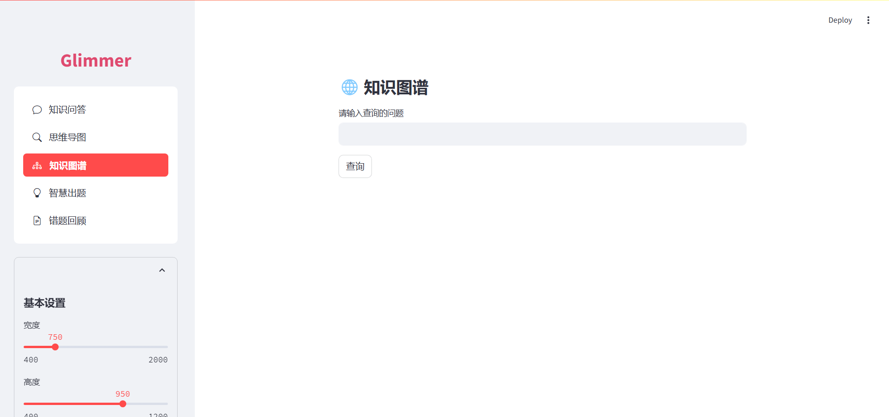
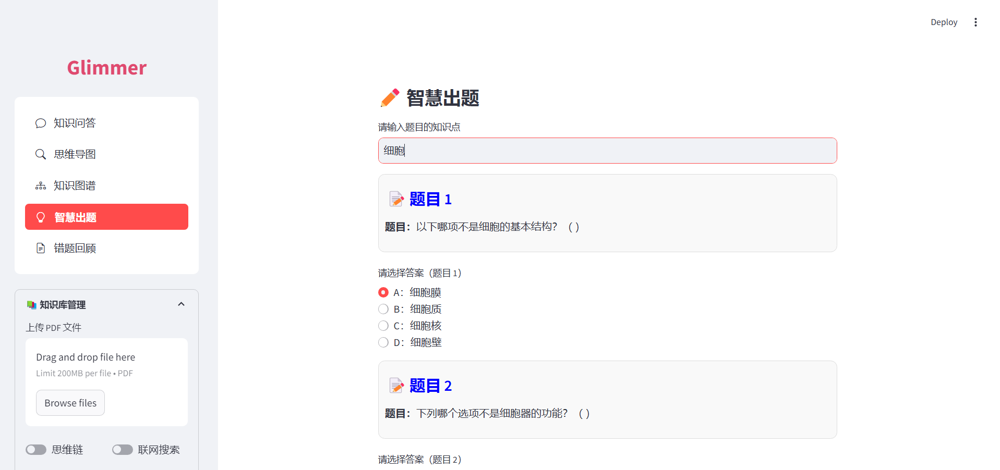
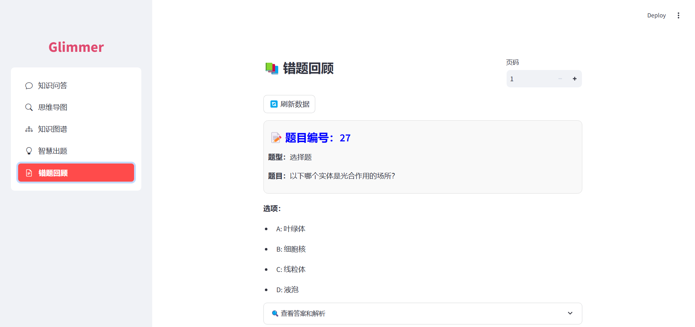

# 云计算项目报告

## 一. 项目背景

### 1. 大语言模型在教育领域的应用

随着人工智能技术的飞速发展，大语言模型（LLM）在教育领域的应用潜力日益凸显。模型通过自然语言处理技术，能够满足学生在知识获取和学习辅导等方面的多样化需求。大语言模型不仅能够提供即时反馈，还能通过深度学习算法不断优化其回答的准确性和相关性，从而提升学习体验。AI+教育正在成为当下的发展趋势。

### 2. 大规模个性化学习的愿景

华东师范大学数据科学与工程学院长期致力于推进大规模个性化学习的愿景。通过水杉在线学习平台和全民数字素养与技能培训基地等平台，学院以数据赋能为宗旨，致力于推动个性化教育的实现。本平台正是顺应这一倡议，旨在通过大语言模型和云计算技术，为学生提供更加个性化和高效的学习体验。

## 二. 市场痛点与解决方案

### 1. 知识存储碎片化、检索零散

传统检索增强生成（RAG）系统主要依赖文本片段的检索与生成，缺乏对知识之间关联性的深度理解。这种模式难以帮助学生构建系统化的知识体系，导致学习效果不佳。

***解决方案***：我们设计了基于图结构的知识库。利用LightRAG的图文本索引范式与双级检索框架，系统能够增强捕捉实体间复杂依赖关系的能力，从而提供更加系统化和结构化的知识检索服务。

### 2. 个性化学习支持不足

传统教育系统往往难以根据学习者的个体需求动态调整学习内容，导致学习效率低下，无法满足不同学习者的个性化需求。

***解决方案***：个性化智能出题与错题定制。通过分析学习者的历史表现与错题记录，系统能够生成定制化的学习内容与评估题目，从而实现精准的个性化学习支持，提升学习效果。

### 3. 知识交互与可视化能力有限

传统系统在知识交互与可视化方面存在明显不足，缺乏对知识之间关联的可视化支持，使得学习者在理解复杂知识体系时面临诸多困难。

***解决方案***：交互式知识图谱与思维导图。利用图结构的特性，系统构建了交互式知识图谱与思维导图，帮助学习者直观理解知识之间的关联，促进深度学习与知识的内化。


## 三.设计思路与系统架构

我们的对该项目的系统架构进行了如下的设计，并在接下来进行实现


基于LangGraph和云技术，我们实现了五大主要功能，分别为知识问答、思维导图、知识图谱、智慧出题、错题回顾。

## 三.技术应用

| 类别         | 技术      | 描述                                                         |
| ------------ | --------- | ------------------------------------------------------------ |
| **云数据库** | SupaBase  | 使用 SupaBase 提供的 PostgreSQL 云数据库，用于持久化存储对话历史和错题数据。 |
|              | Milvus    | 使用 Zilliz Cloud 提供的 Milvus 向量数据库，用于存储文本、实体和关系数据的向量化表示。 |
|              | Neo4j     | 使用 Neo4j 图数据库构建图信息的数据存储，支持复杂的关系查询和分析。 |
| **集成框架** | LangGraph | 使用 LangGraph 构建聊天agent，支持多轮对话和任务处理。       |
| **检索框架** | tevily    | 使用 tevilySearch 实现联网搜索服务，支持实时信息检索和数据获取。 |
| **可视化**   | ECHARTS   | 使用 Echarts 实现思维导图的可视化，支持动态数据展示和交互式操作。 |

以下是润色后的实验报告内容，使其更加丰富和专业：

---

## 四. 实现细节

### 1. LangGraph 框架构建

LangGraph 框架的整体架构如下：


LangGraph 框架的数据存储服务由 Supabase 提供，其数据库 Schema 设计如下：


接下来，我们将对框架的各个模块进行详细介绍。

#### 工具函数

##### 联网搜索 —— TavilySearch

我们集成了 TavilySearch 作为联网搜索工具，通过其 API 提供实时的互联网搜索服务，能够快速检索与用户查询相关的信息。

##### KnowledgeRAG

KnowledgeRAG 功能通过调用 GraphRAG 的 API 实现。该工具能够根据用户问题，从图结构知识库中检索相关知识，并提供精准的答案。

##### WQ_Search

WQ_Search 功能通过向 WQ_Search 的 API 发送请求，检索与用户问题相关的错题数据，帮助用户进行错题复习。

#### 对话历史持久化存储

我们利用 Supabase 为 LangGraph 框架提供了对话历史的持久化存储服务。每个检查点的对话上下文都会被存储，用户可以根据线程恢复历史对话，确保对话的连续性和一致性。

#### 错题 RAG

我们使用智谱的 Embedding 模型将错题数据向量化，并存储至 Supabase。通过创建向量化索引，利用 Supabase 提供的向量搜索功能，实现了基于相似性的错题检索。

#### 对话模型

对话功能由智谱的 API 提供，该 API 基于大语言模型，能够生成流畅且符合上下文的对话响应。

---

### 2. 知识图谱与思维导图可视化

#### 流程图


#### 流程图解读

用户输入想要了解的知识点后，后端将该知识点融入预设的 Prompt 中。针对知识图谱和思维导图，我们设计了不同的 Prompt，以确保后续的格式化展示。随后，将包含知识点的 Prompt 发送至 LightRAG 提供的查询 API。大模型从 Neo4j 图数据库中检索出与该知识点相关的所有实体及其关系，并以结构化数据的形式返回。最终，数据被格式化为交互式的思维导图和知识图谱，供用户浏览和探索。

#### 思维导图可视化工具

思维导图的可视化基于 Streamlit 和 ECharts 实现。我们使用 PyECharts 根据结构化数据生成树状思维导图，并配置图表的样式、布局和节点属性。通过 `st_pyecharts` 将思维导图渲染至前端页面，支持用户进行动态交互。

#### 知识图谱可视化工具

知识图谱的可视化基于 Streamlit-AGraph 实现。我们从 Neo4j 图数据库中提取图结构数据，并使用 Streamlit-AGraph 生成知识图谱。通过配置图表的样式、布局和节点属性，最终使用 `st_agraph` 将知识图谱渲染至前端页面，支持用户进行动态交互。

---

### 3. 智慧出题功能的实现

#### 流程图



#### 流程图解读

用户输入想要测试的知识点后，系统构建专门的 Prompt 并发送至 LightRAG 提供的查询 API。该 API 利用大模型从图数据库中检索相关实体、关系及其描述，整合并提取出有价值的题目返回给用户作答。对于用户答错的题目，系统会将其存入向量数据库，并根据用户的学习情况动态调整错题复习频率。用户还可以对已掌握的错题进行标记，系统会相应减少其复习频率，从而实现个性化的学习支持。

---

### 4. GraphRAG 框架搭建

本项目基于 `LightRAG` 提供的图结构文本索引范式与双级检索框架，搭建了图结构知识库问答系统（`GraphRAG`）。

#### GraphRAG 构建阶段

在构建阶段，文档被自动分割为多个 Chunk，并通过以下步骤实现完整的图知识库构建：

1. **实体与关系提取**：从文本中提取关键实体及其关系。
2. **图谱键值对抽取**：将提取的实体和关系转换为图谱中的节点和边。
3. **关系聚合**：对相似关系进行聚合，优化图谱结构。

构建阶段的流程图如下：



#### GraphRAG 检索阶段

在检索阶段，采用高效的双级检索策略：

1. **低级别检索**：专注于特定实体及其关系的精确信息。
2. **高级别检索**：涵盖更广泛的主题和概念，确保检索结果的全面性。

通过结合详细和概念性检索，GraphRAG 能够有效应对多样化的查询需求，为用户提供与其特定需求相关的全面响应。

检索阶段的流程图如下：




## 五.Graph RAG效果评估

### 测试方法

为了全面评估传统 RAG 和 Graph RAG 在知识检索与生成方面的性能差异，我们选取了中学生物的一个典型问题："DNA 是怎么指导蛋白质合成的？"作为测试案例。通过对两种方法的回答进行对比分析，我们采用LLM评估，通过指定评估标准，从**全面性**、**多样性**和**拓展性**三个核心维度进行了分析。

### 测试结果与分析

#### 1. 回答内容对比

| **方法**      | **回答内容**                                                 |
| ------------- | ------------------------------------------------------------ |
| **传统 RAG**  | DNA 指导蛋白质合成的过程主要包括两个主要步骤：转录和翻译。<br>1. **转录**：发生地点为细胞核内（真核细胞），DNA 的一条链作为模板，通过 RNA 聚合酶的作用，合成一条与之互补的 mRNA 分子。<br>2. **翻译**：发生地点为细胞质中的核糖体，当遇到终止密码子时，翻译过程停止，肽链从核糖体上释放，最终形成具有特定功能的蛋白质。 |
| **Graph RAG** | DNA 指导蛋白质合成的过程，即蛋白质的生物合成，是细胞生命活动中至关重要的一环。<br>1. **转录**：包括 DNA 模板的识别、RNA 的合成和转录终止。<br>2. **翻译**：包括 mRNA 的转运、tRNA 的识别、肽链的合成以及蛋白质的折叠和修饰。 |

#### 2. LLM 评估

| **评估维度** | **传统 RAG**                                                 | **Graph RAG**                                                |
| ------------ | ------------------------------------------------------------ | ------------------------------------------------------------ |
| **全面性**   | 简要介绍了转录和翻译的基本步骤，但细节较少，缺乏对关键子过程的深入描述。 | 提供了更详细的步骤说明，包括 mRNA 的转运和蛋白质折叠，内容更加全面且深入。 |
| **多样性**   | 信息较为单一，主要集中在转录和翻译的基本过程上，未涉及其他相关生物分子。 | 涵盖更多类型的生物分子（如 tRNA、mRNA）及其功能，展示了更多信息维度。 |
| **拓展性**   | 适合快速获取基本信息，但深度有限，难以激发用户进一步探索的兴趣。 | 通过详细解释和额外背景信息，帮助读者建立更深层次的理解，并激发进一步探索的兴趣。 |

通过对比测试，我们发现Graph RAG在以下方面表现显著优于传统 RAG：

1. **全面性**：Graph RAG 提供了更详细的步骤说明，涵盖了转录和翻译的更多细节，能够满足用户对深度知识的需求。
2. **多样性**：Graph RAG 展示了更多类型的生物分子及其功能，信息维度更加丰富，有助于用户构建系统化的知识体系。
3. **拓展性**：Graph RAG 通过详细解释和额外背景信息，帮助用户建立更深层次的理解。
   而相比之下，传统 RAG 虽然适合快速获取基本信息，但在深度和广度上存在明显不足，难以满足复杂知识场景的需求。Graph RAG 在知识检索和生成方面具有优势，特别是在需要深入理解和多维度分析的场景中。这证明了我们方案的有效性。

## 六.前端页面

前端分为以下几个页面：

1. **欢迎页面**：用户访问平台的初始页面，点击'JOIN AND TRY'按钮即可跳转至主页面。
2. **知识问答**：学生可提出问题并获取基于知识库的答案，大模型同时还会参考学生的错题集对学生的学习给出建议。在左侧侧边栏，学生可上传自己的pdf构建知识库，也可以选择已有的知识库。
3. **思维导图**：提供交互式思维导图功能，学生输入自己想知道的知识点，后端根据知识库动态构建思维导图。用户同样可以选择、改变使用的知识库。
4. **知识图谱**：展示知识点之间的关联，根据学生输入的知识点，动态梳理知识点实体之间的联系，构建可交互式的知识图谱。
5. **智慧出题**：根据知识点生成个性化题目，支持练习和测试。学生做错的题目可以自动加入错题集。
6. **错题回顾**：学生可以在该页面复习自己的错题，可以查看答案和解析，如果学生觉得题目已经掌握，可以点击按钮，之后该题目复习的概率将会降低。

前端页面的设计逻辑如下：


平台各个页面的展示如下：
1. 知识问答页面

2. 思维导图页面

3. 知识图谱页面

4. 智慧出题页面

5. 错题回顾页面


## 七. 平台环境部署

请按照 `requirements.txt` 文件安装所需的 Python 库。运行以下命令：

```bash
pip install -r requirements.txt
```

### LightRAG 运行环境安装

#### 1. 从源码安装（推荐）

```bash
cd LightRAG
pip install -e .
```

#### 2. 从 PyPI 安装

```bash
pip install lightrag-hku
```

### Neo4j 配置

在 `LightRAG/api.py` 文件中，修改以下配置以连接 Neo4j 数据库：

```python
os.environ["NEO4J_URI"] = "###"  # 替换为你的 Neo4j URI
os.environ["NEO4J_USERNAME"] = "###"  # 替换为你的 Neo4j 用户名
os.environ["NEO4J_PASSWORD"] = "###"  # 替换为你的 Neo4j 密码
```

### Milvus 配置

在 `LightRAG/api.py` 文件中，修改以下配置以连接 Milvus 向量数据库：

```python
vector_db_config = {
    "自定义知识库": {
        "uri": "###",  # 替换为你的 Milvus URI
        "user": "###",  # 替换为你的 Milvus 用户名
        "password": "###",  # 替换为你的 Milvus 密码
        "token": "###",  # 替换为你的 Milvus Token
        "db_name": "base"
    },
    "中学生物": {
        "uri": "###",  # 替换为你的 Milvus URI
        "user": "###",  # 替换为你的 Milvus 用户名
        "password": "###",  # 替换为你的 Milvus 密码
        "token": "###",  # 替换为你的 Milvus Token
        "db_name": "biology"
    },
    "中学信息技术": {
        "uri": "###",  # 替换为你的 Milvus URI
        "user": "###",  # 替换为你的 Milvus 用户名
        "password": "###",  # 替换为你的 Milvus 密码
        "token": "###",  # 替换为你的 Milvus Token
        "db_name": "information-technology"
    }
}
```

### 启动后端服务

环境配置完成后，运行以下命令启动后端服务：

```bash
python api.py
```

### 前端页面运行

前端页面基于 Streamlit 开发，运行前请确保已安装 Streamlit 库：

```bash
pip install streamlit streamlitmenu
```

在运行前端之前，请确保后端服务已启动。前端代码位于 `streamlit_app.py` 中，执行以下命令启动前端：

```bash
streamlit run streamlit_app.py
```

## 分工

| 姓名 | 职责 | 贡献 |
|------|------|------|
| 石季凡 | LangGraph框架构建、错题集RAG实现 | 25% |
| 蔡祺枫 | 前端主体页面实现、思维链问答实现 | 25% |
| 顾树焕 | 智慧出题功能实现、思维导图可视化 | 25% |
| 袁凡 | GraphRAG框架构建、知识图谱可视化 | 25% |

## 致谢

本项目使用了以下开源项目：

* [LangGraph](https://github.com/langchain-ai/langgraph) - MIT License
* [Tavily Search API](https://github.com/tavilysearch/tavily-python) - MIT License
* [Streamlit](https://github.com/streamlit/streamlit) - Apache License

感谢这些项目的贡献者们！
