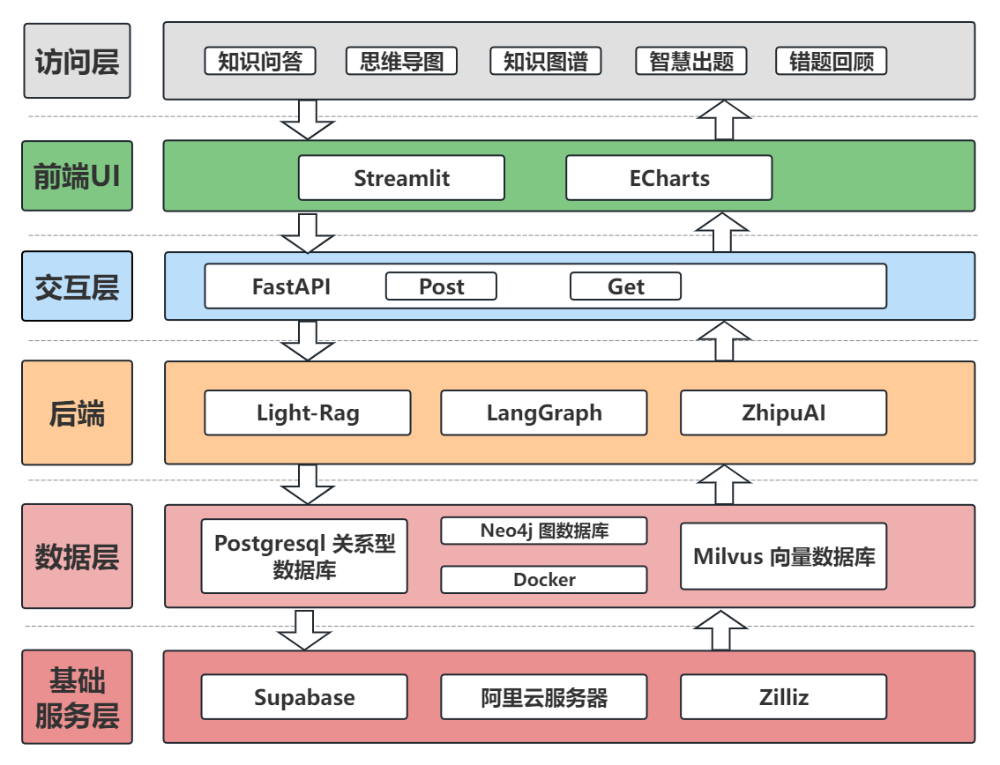
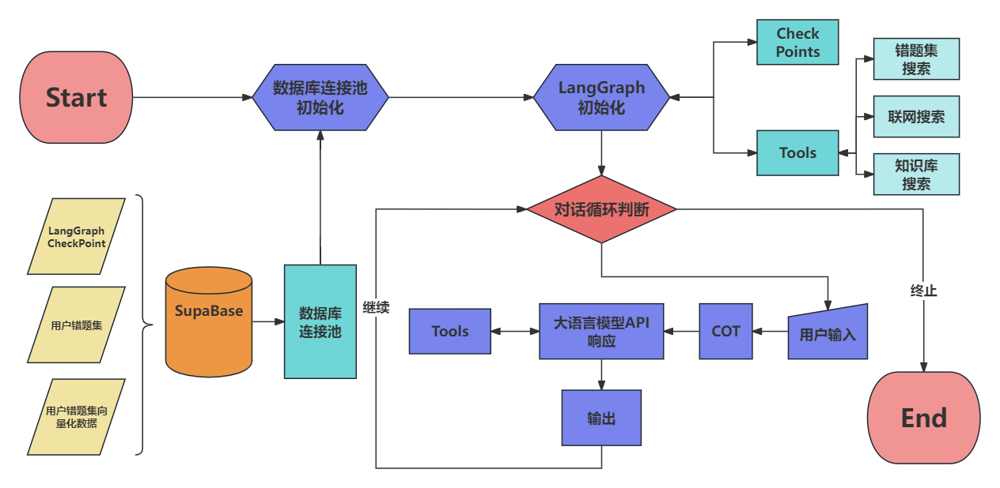
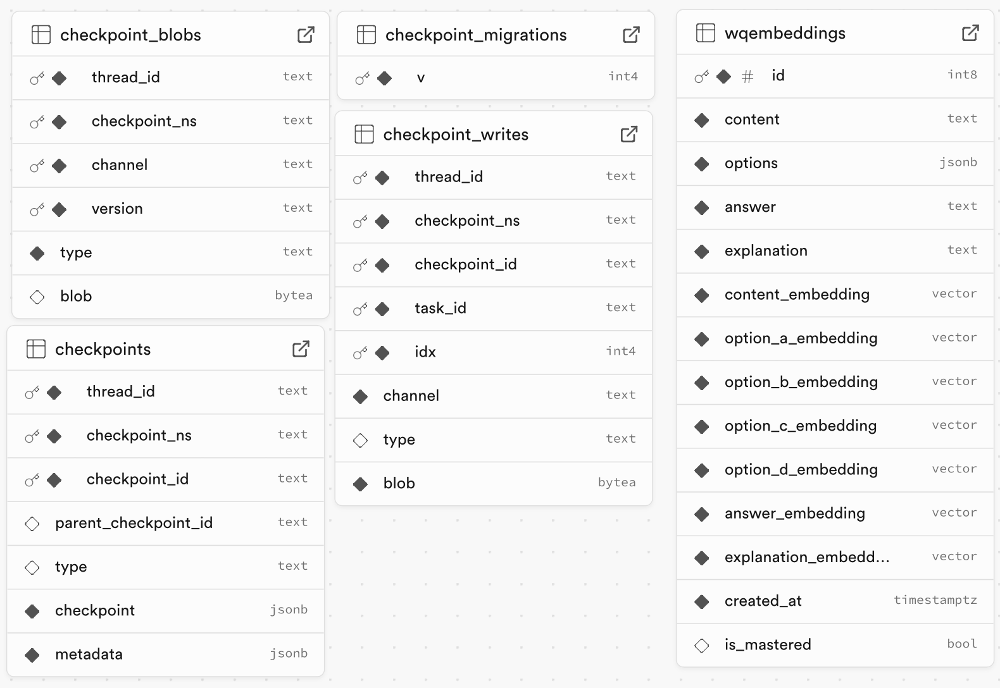
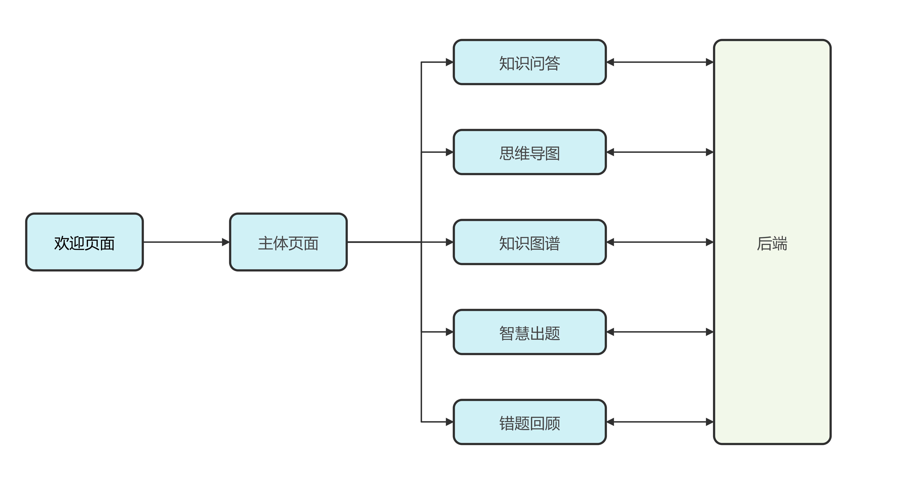

# 云计算项目报告

## 一.项目背景

### 1.大语言模型在教育的使用

随着人工智能技术的快速发展，大语言模型在教育领域的应用潜力日益凸显。通过语言模型可以满足学生问答等场景的需求。

### 2.大规模个性化学习的愿景

数据科学与工程学院长期坚持推进大规模个性化学习的愿景。通过水杉在线学习平台、全民数字素养与技能培训基地等平台，通过数据赋能，推进个性化教育。本平台正顺应这一倡议。

## 二.市场痛点与解决方案

### 1.知识存储碎片化、检索零散

传统RAG主要依赖文本片段的检索与生成，缺乏对知识之间关联性的深度理解，难以帮助学生构建系统化的知识体系。

***解决方案***：基于图结构的知识库构建，利用LightRAG的图文本索引范式与双级检索框架增强了系统捕捉实体间复杂依赖关系的能力。

### 2.个性化学习支持不足

传统系统难以根据学习者的个体需求动态调整学习内容，导致学习效率低下。

***解决方案***：个性化智能出题与错题定制，根据学习者的历史表现与错题记录，生成定制化的学习内容与评估题目，实现精准的个性化学习支持。

### 3.知识交互与可视化能力有限

传统系统缺乏对知识之间关联的可视化支持，在理解复杂知识体系时面临诸多困难。

***解决方案***：交互式知识图谱与思维导图，利用图结构特性，构建交互式知识图谱与思维导图，帮助学习者直观理解知识之间的关联，促进深度学习。

## 三.设计思路与系统架构

我们的对该项目的系统架构进行了如下的设计，并在接下来进行实现

## 三.技术实现

## 3.Langgraph框架的构建

Langgraph的框架构建如下

Langgraph框架的数据存储服务由supabase来提供，schema如下

接下来对框架进行具体介绍

### 工具函数

#### 联网搜索——tavilysearch

联网搜索工具函数我们使用了tavilysearch提供了联网搜索服务

#### KnowledgeRag

这一功能由GraphRag提供api服务，该工具通过向GraphRag的api发送请求以获得问题中对应的知识

#### wq_search

该功能用于通过向wq_search的api发送请求以获得问题相关的错题

### 对话历史持久话存储

我们用supabase为我们的Langgraph的框架提供了每个检查点的存储，这一用户可以根据线程恢复历史对话上下文

### 错题Rag

我们用智谱的embedding模型将错题进行embedding后存储至supabase，并创建了向量化的索引，用supabase提供的向量化搜索来实现相似性的搜索

### 对话

对话的模型我们选择了智谱的API来提供

## 四.页面逻辑

## 致谢

本项目使用了以下开源项目：

* [LangGraph](https://github.com/langchain-ai/langgraph) - MIT License
* [Tavily Search API](https://github.com/tavilysearch/tavily-python) - MIT License
* [Streamlit](https://github.com/streamlit/streamlit) - Apache License

感谢这些项目的贡献者们！
